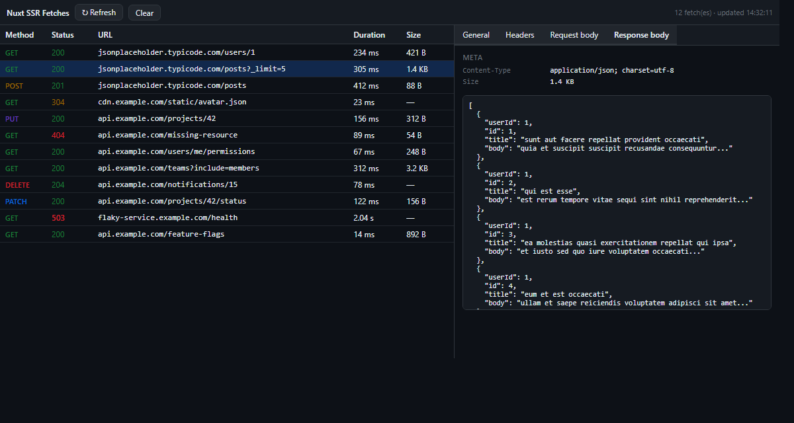

# nuxt-ssr-devtools

[](./README.md) [](./README.en.md)

> **Chrome DevTools extension + server module for debugging Nuxt SSR fetches**

[](https://www.npmjs.com/package/nuxt-ssr-devtools)
[](https://www.npmjs.com/package/nuxt-ssr-devtools)
[](./LICENSE)



> ⚠️ **You need to install BOTH parts**
>
> 1. The **npm package** in your Nuxt app + register it in `nuxt.config.ts` → server collects SSR fetch data.
> 2. The **Chrome extension** loaded unpacked → renders that data in the "Nuxt SSR Fetches" DevTools panel.
>
> Package only: data is collected but no UI to view it. Extension only: nothing to read.

## Quick install

```bash
npm install nuxt-ssr-devtools
```

📦 **npm**: https://www.npmjs.com/package/nuxt-ssr-devtools

After installing the npm package, follow the [integration guide](#integrate-into-a-nuxt-project) to add one line to `nuxt.config.ts`, then install the Chrome extension per the [extension install](#install-the-extension) section.

---

## Problem: SSR data fetching is hard to debug

In Nuxt, `useFetch` / `$fetch` calls run **inside the Node.js server** during
SSR. The browser only receives the rendered HTML, so **none of those fetches
show up in DevTools' Network tab.**

Result:
- You can't see which URLs were called with which methods
- You can't inspect request/response headers
- You can't view response bodies
- You don't know latency
- Non-developers (QA, PM) have no way to see "what data does this page actually fetch?"

Alternatives like `console.log` or nitro dev output only show up in the
terminal — non-developers can't see them. OpenTelemetry/Sentry are heavy and
need a separate backend.

## Solution: capture on the server → render in a DevTools panel

The project has two parts:

```
┌──────────────────────────────┐         ┌──────────────────────────┐
│  Nuxt Nitro server           │         │  Browser                 │
│                              │         │                          │
│  Patch globalThis.fetch      │         │   "Nuxt SSR Fetches"     │
│  → URL/method/status/        │  HTML   │   DevTools panel         │
│    duration/headers/body     │ ──────► │   reads requestId from   │
│    captured                  │         │   <script> marker,       │
│                              │         │   calls API →            │
│  Stored in in-memory         │         │   renders table + detail │
│  registry per session        │ ◄────── │                          │
│  /api/ssr-devtools serves it │  fetch  │                          │
└──────────────────────────────┘         └──────────────────────────┘
```

**Developers**: `npm install` once + 1 line in `nuxt.config.ts` → done.
**Non-developers (QA/PM)**: install the Chrome extension once → open DevTools, click "Nuxt SSR Fetches" → done.

## How it works

### 1. Intercept SSR fetches — `globalThis.fetch` monkey-patch

A Nitro plugin registered by the Nuxt module runs once at server startup,
replacing `globalThis.fetch` with a wrapper. From then on every `useFetch`,
`$fetch`, or raw `fetch` call goes through it.

```ts
const original = globalThis.fetch
globalThis.fetch = async (input, init) => {
  const startedAt = Date.now()
  const response = await original(input, init)
  // capture URL, method, status, duration, headers, body
  recordEntry({ ... })
  return response
}
```

Bodies are streams (read-once), so we use `response.clone()` and read up to
the configured size limit (100 KB default), truncating beyond that.

### 2. Capture client-side fetches too (v0.2.0+)

Nuxt's SPA routing (NuxtLink) doesn't hit the server — routing happens entirely
in the browser. SSR-only capture would miss every fetch made after the initial
page load.

A Nuxt plugin registered with `mode: 'client'` patches `window.fetch` in the
browser. On each Vue Router `beforeEach`, the plugin generates a new client
session id and updates the DOM marker. Captured fetches are POSTed to
`/api/ssr-devtools` in 200ms-debounced batches and stored in the same in-memory
registry as SSR sessions — the panel sees one unified timeline.

### 3. Group fetches by request — `useEvent()` + WeakMap

When many fetches happen, we need to bucket them by request. In Nuxt/Nitro,
**`useEvent()` from `nitropack/runtime` returns the current request's
`H3Event` reference** — the same reference across every code path inside one
request. So a `WeakMap<H3Event, Session>` is the natural keying:

```ts
import { useEvent } from 'nitropack/runtime'

function getCurrentSession() {
  const event = useEvent() // same reference within one request
  let session = sessionByEvent.get(event)
  if (!session) {
    session = { requestId: randomUUID(), entries: [] }
    sessionByEvent.set(event, session)
  }
  return session
}
```

The module enables `nitro.experimental.asyncContext: true` automatically so
this works.

### 4. Ship to the browser — `<script>` marker + API route

Two pieces bridge server data to the browser:

**Nitro `render:html` hook** — appends a marker to the body of every SSR response:
```html
<script data-ssr-devtools data-ssr-devtools-request-id="..." data-ssr-devtools-api-path="/api/ssr-devtools"></script>
```

**`/api/ssr-devtools` route handler** — pulls the session for that requestId from the in-memory registry and returns it as JSON.

### 5. Chrome DevTools extension

MV3 extension with no `host_permissions` needed (uses
`chrome.devtools.inspectedWindow.eval` to fetch in the page context):

```js
// 1. read marker from page
const { requestId, apiPath } = readMarker()
// 2. fetch same-origin (browser handles it, no permission needed)
const session = await fetch(apiPath + '?id=' + requestId).then(r => r.json())
// 3. render table + detail panel
```

Auto-refreshes on page navigation (`chrome.devtools.network.onNavigated`).

## Repo layout

| Path | Contents |
|---|---|
| `packages/server/` | `nuxt-ssr-devtools` — npm package (Nuxt module) |
| `packages/extension/` | Chrome MV3 DevTools extension |
| `examples/nuxt-demo/` | Demo app for verification |

## Integrate into a Nuxt project

> Requirements: **Nuxt 3.10+** + Nitro 2.x.

### 1. Install the package

```bash
npm install nuxt-ssr-devtools
```

### 2. `nuxt.config.ts`

```ts
export default defineNuxtConfig({
  modules: ['nuxt-ssr-devtools'],
})
```

That's it. Open a Nuxt page, open DevTools, switch to the **Nuxt SSR Fetches**
tab.

The module automatically:
- Patches `globalThis.fetch` on the server
- Enables Nitro `experimental.asyncContext`
- Injects the marker into SSR HTML
- Registers the `/api/ssr-devtools` route

## Install the extension

Load unpacked from source:

1. Clone this repo or [download as ZIP](https://github.com/leeyounagh/nuxt-fetch-inspector/archive/refs/heads/main.zip)
2. Open `chrome://extensions`
3. Enable **Developer mode** (top right)
4. Click **Load unpacked** → select `packages/extension/`
5. Open a Nuxt page → DevTools (F12) → **Nuxt SSR Fetches** tab

## Usage notes

- **Initial page load (SSR)** — `useFetch` / `$fetch` / raw `fetch` running on
  the server are captured into a session keyed on the `H3Event`.
- **Client-side navigation (NuxtLink)** — since v0.2.0, `window.fetch` on the
  browser is also patched. Each route change starts a new client session, the
  DOM marker is updated, and captured fetches are POSTed to the server in
  200ms-debounced batches. Panel auto-updates as you click around.
- The panel auto-refreshes on full page navigation
  (`chrome.devtools.network.onNavigated`) and polls every 2s. Manual **Refresh**
  is still useful for edge cases (e.g. server actions completing after the
  poll window).
- Live SSE push is planned.

## Configuration

```ts
export default defineNuxtConfig({
  modules: ['nuxt-ssr-devtools'],
  ssrDevtools: {
    enabled: true,                // disable in production by default
    maxBodySize: 100_000,         // bytes; bodies above this are truncated
    maxSessions: 200,             // recent sessions kept in memory
    redactHeaders: ['authorization', 'cookie', 'set-cookie', 'x-api-key'],
    apiPath: '/api/ssr-devtools', // route the extension reads from
    ignorePatterns: [             // url substrings to skip (Nuxt dev internals)
      '/__nuxt_vite_node__/',
      '/__nuxt_devtools__/',
      '/_nuxt/',
      '/_ipx/',
    ],
  },
})
```

## Local development

```bash
npm install
npm run build               # build the server module
npm run demo                # run demo app → http://localhost:3000
```

After editing `packages/server/src/*`, run `npm run build` in that workspace
and restart the demo.

## License

MIT
